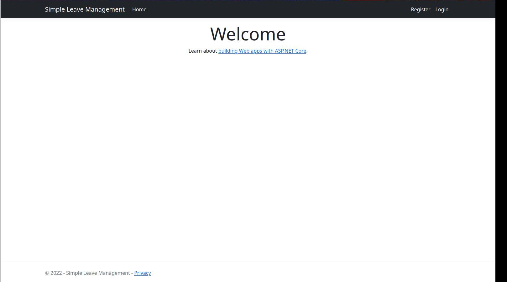
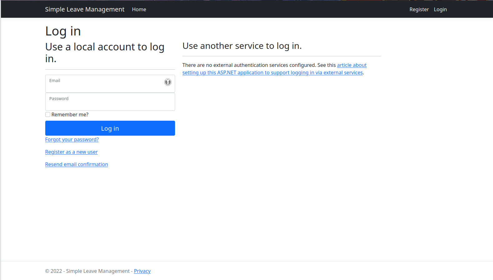
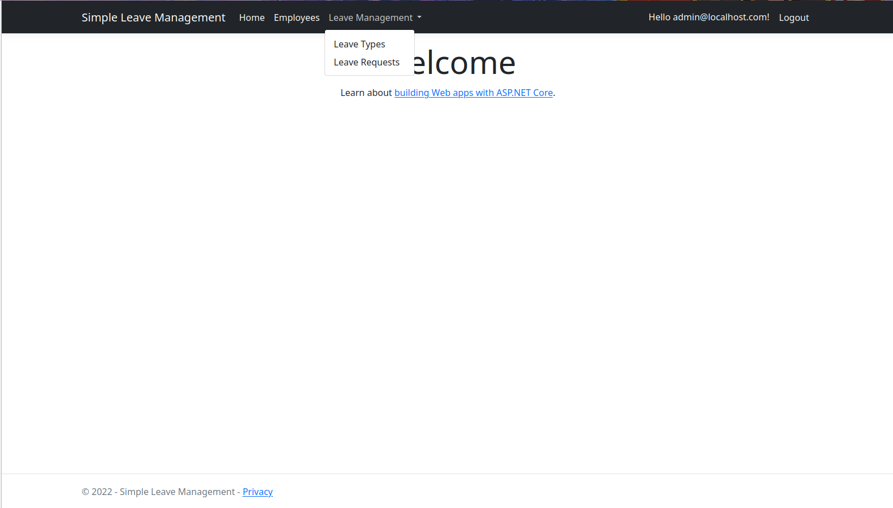
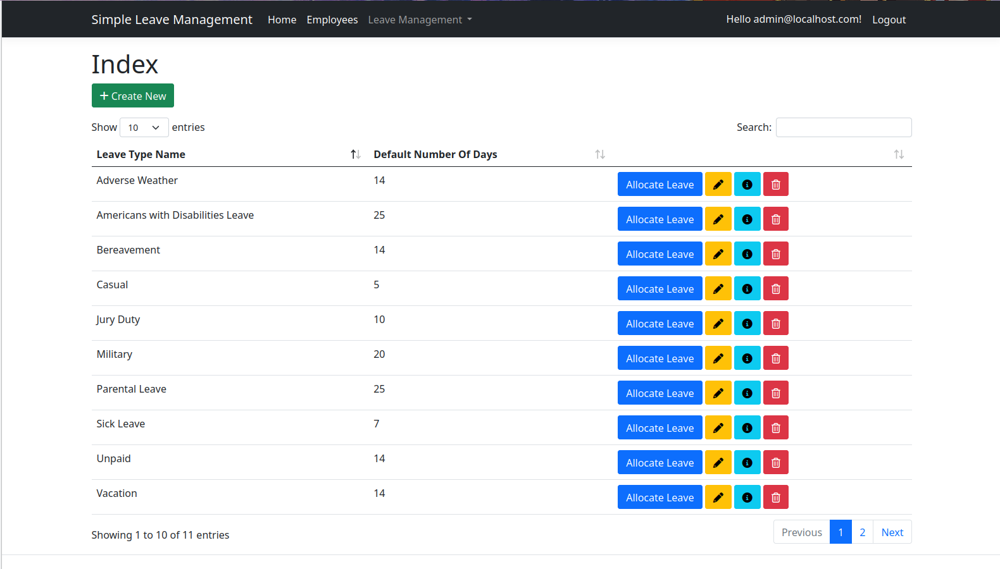
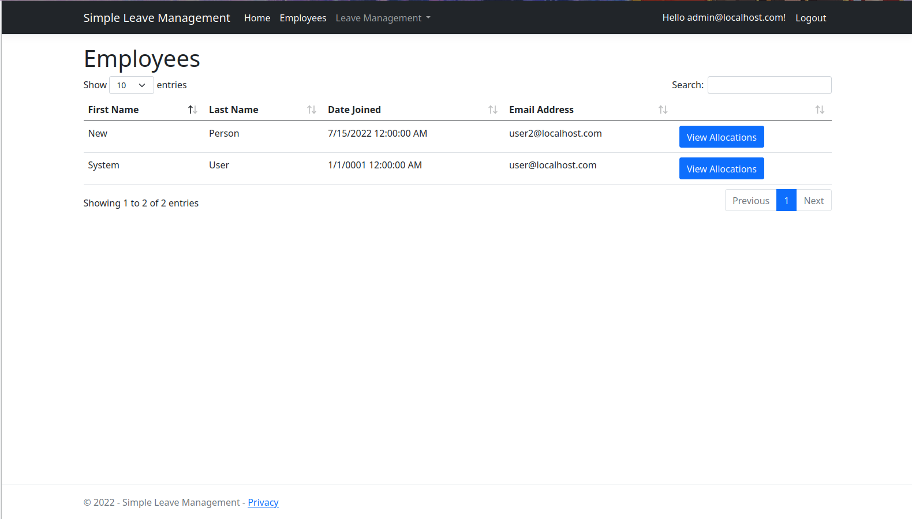
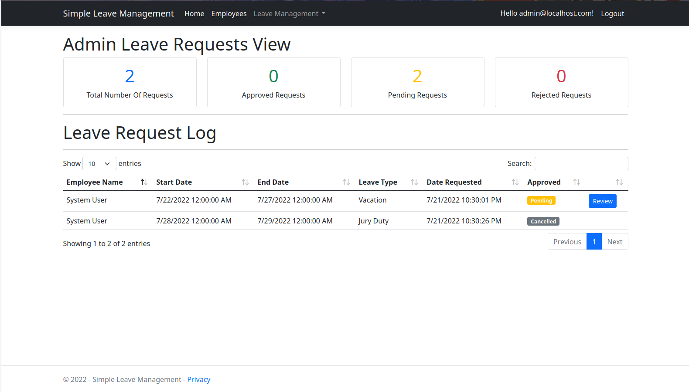
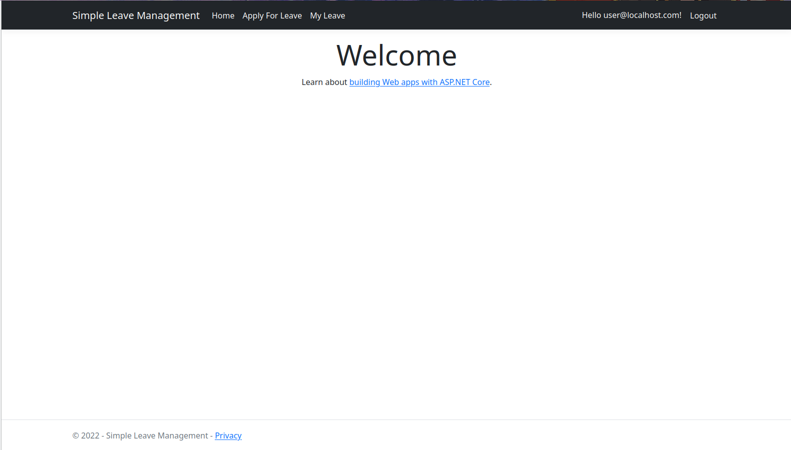
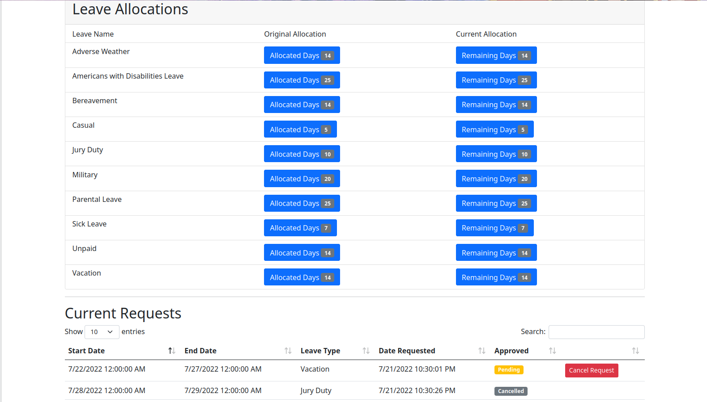
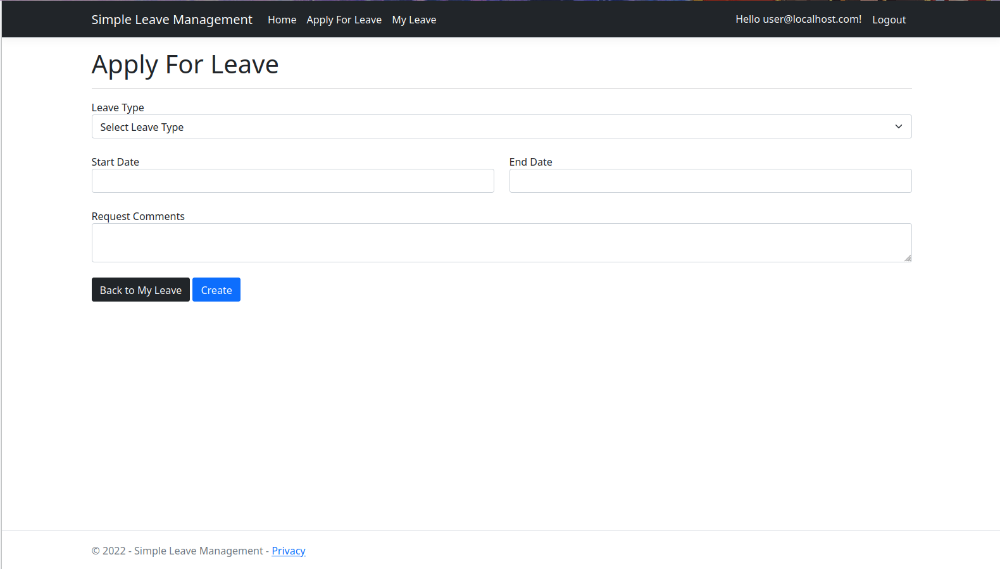

# Simple Leave Management
A demonstration project built around ASP.NET using C# 10 and .Net 6.
## Introduction
This project is a demonstration of using ASP.Net to create a CRUD application for managing the leave
of registered employees. The application is very rough and should not be used in production.
## Technologies
- [.Net](https://dotnet.microsoft.com/en-us/) 6.0
- [ASP.NET](https://dotnet.microsoft.com/en-us/apps/aspnet)
- [Serilog](https://serilog.net/)
- [Automapper](https://automapper.org/)
- [SQLite](https://www.sqlite.org/index.html)
- [Font Awesome](https://fontawesome.com/)
- [Sweetalert](https://sweetalert2.github.io/)
- [Bootstrap](https://getbootstrap.com/)

## Getting Started
This project can be run in Rider or Visual Studio by opening the solution file in the root directory.
If you are using VSCode then navigate to the SimpleLeaveManagement.Web directory and type the following
commands:
```
dotnet restore
dotnet run
```
The web server will run and use any browser to go to the following address:
```
https://localhost:7238/
```
There you will be greeted with a welcome screen and the option to login or register.
There is at lease one user and one admin account available for use. Their username and passwords are as follows:
admin:
```
username: admin@localhost.com
password: !QA2ws#ED
```
user:
```
username: user@localhost.com
password: P@ssword1
```
The user you choose to login with determines what options will be available to you.
## Usage
To begin with the database in use is an SQLite database that is included in the project directory. There 
is some data that is already populated with regards to types of leave and some allocations to the current employee.
When creating types of leave you give it a name and default number of days for allocations.
You can add more days to specific employees. These allocations must be assigned to the employees all 
at once manually. That means if you create a new employee after assign allocations then you have to 
assign them again or the new employee has none. I should fix that... Employees cannot use leave types they are 
not allotted. They may use more than they have and will be blocked from doing so. They can also cancel their 
requests.
## Screenshots









## What Needs Work?
Everything. Security, UI/UX, business logic. Don't use this in production.